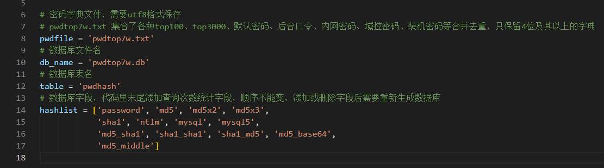
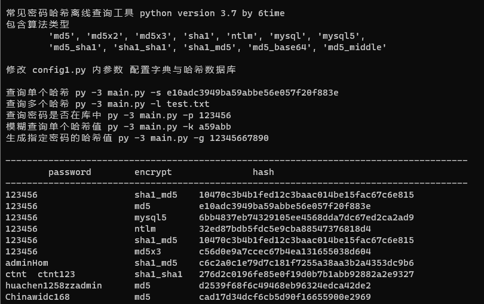
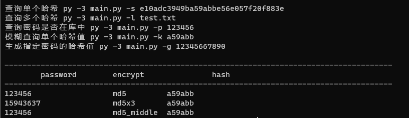
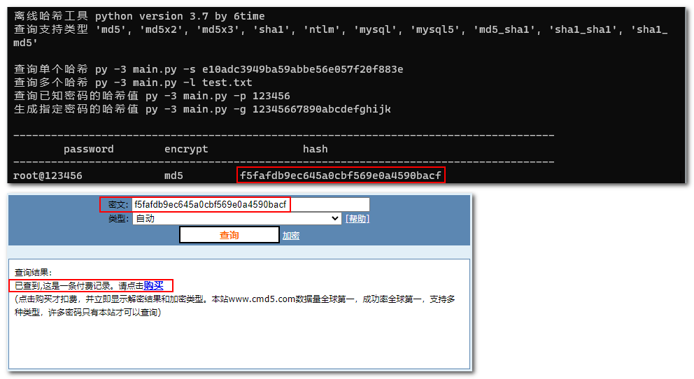

# toppwdhash

一款常见密码哈希离线查询工具，包含算法类型 ：  'md5', 'md5x2', 'md5x3', 'sha1', 'ntlm', 'mysql', 'mysql5',  'md5_sha1', 'sha1_sha1', 'sha1_md5', 'md5_base64', 'md5_middle'；支持单个查询、批量查询、模糊查询、明文密码哈希生成等，后续可能加入更多功能。

即将加入的算法：base64(md5($psss))、md5(sha256($pass))、sm3 ------预计3周内

考虑加入的算法：sha256、sha256(md5($pass))

# 介绍


``````bash
常见密码哈希离线查询工具 python version 3.7 by 6time 
包含算法类型 
'md5', 'md5x2', 'md5x3', 'sha1', 'ntlm', 'mysql', 'mysql5',
'md5_sha1', 'sha1_sha1', 'sha1_md5', 'md5_base64', 'md5_middle'

修改 config1.py 内参数 配置字典与哈希数据库

查询单个哈希 py -3 main.py -s e10adc3949ba59abbe56e057f20f883e
查询多个哈希 py -3 main.py -l test.txt
查询密码是否在库中 py -3 main.py -p 123456
模糊查询单个哈希值 py -3 main.py -k a59abb
生成指定密码的哈希值 py -3 main.py -g 12345667890
``````


# 支持类型选择

参考 www.cmd5.com 无加盐情况，有以下哈希方式，均与网站计算结果一样

password: 123456

md5: e10adc3949ba59abbe56e057f20f883e

md5(md5($pass)): 14e1b600b1fd579f47433b88e8d85291

md5(md5(md5($pass))): c56d0e9a7ccec67b4ea131655038d604

mysql: 565491d704013245

mysql5: 6bb4837eb74329105ee4568dda7dc67ed2ca2ad9

ntlm: 32ed87bdb5fdc5e9cba88547376818d4

sha1: 7c4a8d09ca3762af61e59520943dc26494f8941b

sha1(sha1($psss)): 69c5fcebaa65b560eaf06c3fbeb481ae44b8d618

sha1(md5($psss)): 10470c3b4b1fed12c3baac014be15fac67c6e815

md5(sha1($psss)): d93a5def7511da3d0f2d171d9c344e91

md5(base64($psss)): 87d9bb400c0634691f0e3baaf1e2fd0d *这里与cmd5不一样，先bsae64再md5计算方式*

md5_middle：49ba59abbe56e057

**未加入算法说明**

未加入 md5(unicode) 在python3不好实现，使用频率不大，不研究了

未加入 sha256、sha256(md5($pass))、sha384、sha512 长度不同很明显，且使用频率不大

未加入 base64(md5($psss)) 奇怪的方式，个人认为使用频率不大，实际更可能是 base64(aes($psss)) 、 base64(des($psss)) 等方式

# 使用方式

**直接修改config1.py文件，可替换字典和哈希数据库**，修改后运行会自动生成哈希数据库

默认自带一个七万常见密码合集字典（生成的db数据库31MB大小），包含各种top100、top3000、默认密码、后台口令、内网密码、域控密码、装机密码等**合并去重，只保留4位及其以上**的字典



读取文件查询多个哈希，如果密码不对，可能是末尾有空格



模糊查询哈希，哈希值片段最好是6位以上的




# 写小工具的原因

1、类似root@123456这样内网top100密码的哈希，查询cmd5网站需要收费

2、遇到需要频繁查询的情况，不能每次都去发群求解

3、不想付费查询，或需要批量查询觉得费用太大



# 使用更大的密码字典？

个人认为不需要使用那些百万级别的字典，因为常见密码、默认密码在合并去重后变化不大，字典的日常更新、维护其实才是决定性因素，密码哈希查询只是渗透过程中一个微小的点，不值得投入太多，大多数情况本工具能解决就行了。

针对指定目标的**社工字典**，根据工具生成字典后，修改config1.py配置即可，简单实用 ：）

# 有跑哈希工具为什么还要写一个数据库版本的？

主要是加快被第三方工具调用碰撞速度
